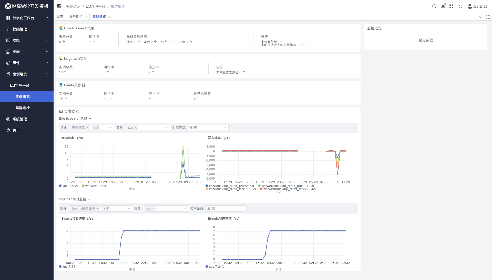
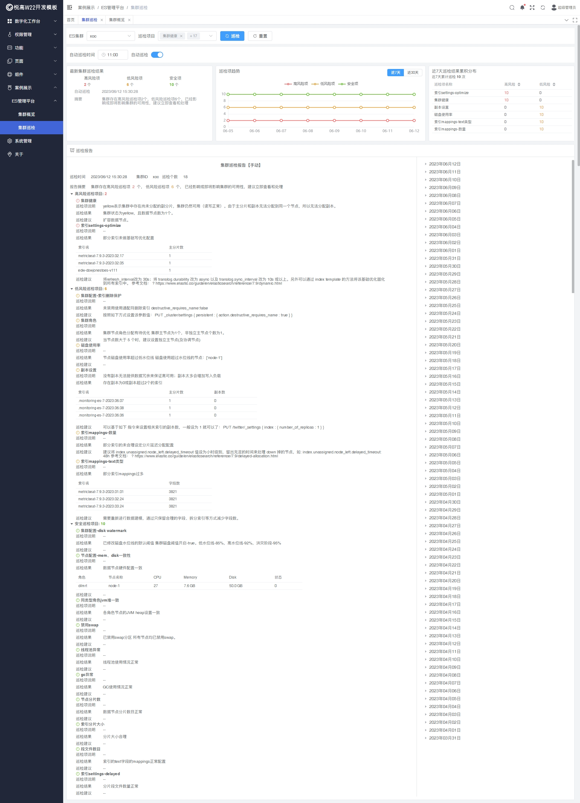
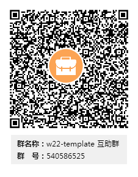

```shell
           ___   ___               __                           __        __
 _      __|__ \ |__ \             / /_ ___   ____ ___   ____   / /____ _ / /_ ___
| | /| / /__/ / __/ /   ______   / __// _ \ / __ `__ \ / __ \ / // __ `// __// _ \
| |/ |/ // __/ / __/   /_____/  / /_ /  __// / / / / // /_/ // // /_/ // /_ /  __/
|__/|__//____//____/            \__/ \___//_/ /_/ /_// .___//_/ \__,_/ \__/ \___/
                                                    /_/
```

<p align="center">
<a href="https://github.com/YogooSoft/yogoo-w22-template/blob/main/LICENSE"></a>
<a href="https://www.yogoo.net"></a>
<a href=""></a>
<a href=""></a>
</a>
</p>

## 简介

w22-template 是一个免费开源的中后台模板，采用最新的 Vue3、Webpack、TypeScript 等主流技术进行开发，为开发者提供了快速构建高效中后台系统的一站式解决方案。这个模板不仅可以帮助开发者快速上手，还可以作为学习和参考。

## 特性

- 该特性采用了 Vue3、Webpack、TypeScript 和 Element-plus 技术栈,具有灵活的组件化开发能力和强大的性能表现。
- 支持 Webpack 打包工具,能够将多个模块打包成一个或多个文件,方便开发者进行部署和扩展。
- 内置了一些常用的中后台功能,如表单提交、数据存储、权限管理、API 调用等,能够满足大部分中后台系统的需求。
- 内置完整的动态路由、菜单等权限生成方案。
- 对多个常用组件进行了二次封装,提高了组件的性能和可维护性。
- 修补了各种组件已知的 BUG,保证了组件的稳定性和可靠性。
- 提供了丰富的组件示例代码与文档,方便开发者进行学习和使用。

## 案例截图




## 快速上手

### 安装

使用时首先需要下载本仓库 Clone 或者 Fork 这个项目：

```shell
git clone https://github.com/YogooSoft/yogoo-w22-template.git
cd yogoo-w22-template
```

在根目录执行：

```shell
yarn install
```

### 构建并运行

在仓库根目录运行以下命令：

```shell
yarn serve
```

### 编译打包

```shell
yarn build
```

## 代码贡献者

感谢所有为 w22 做出过贡献的人！

## 团队介绍

- 我们的开源 W22 框架团队是由一群技术大牛组成，旨在帮助程序员和企业快速开发迭代他们的软件产品。
- 我们本着共同的爱好，收集广大程序员的开发诉求，不断开发能够帮助我们实现更高效、更快速的开发流程的 Web 框架。
- 我们的主旨是让软件开发快一点。我们致力于培养更多 W22 的开发者，帮助他们掌握最新的技术和方法，成为行业的佼佼者。
- 加入我们，你将有机会与一群志同道合的技术大佬一起工作，分享你的经验和见解，共同成长。
- 我们的团队氛围和谐，充满了活力和创造力，让你在工作的同时也能享受愉悦的办公环境。
- 如果对我们的开源 W22 框架团队感兴趣，欢迎随时联系我们。我们期待你的加入！

## 微信群

<!--  -->


## 免责声明

你可以将 w22-template 用于商业用途但请注意我们不接受商业化需求定制与部署支持以及其它客户服务。如有相关需求请前往[悦高软件](https://www.yogoo.net)。

本项目仅用于学习和交流使用，请遵守所在国的法律法规，切勿用于涉及政治、宗教、色情、犯罪等领域，一切违法后果请自负。

## 许可证

版权所有 Yogoo, Inc. 保留所有权利。

使用 [MIT 许可证](/LICENSE.txt)
